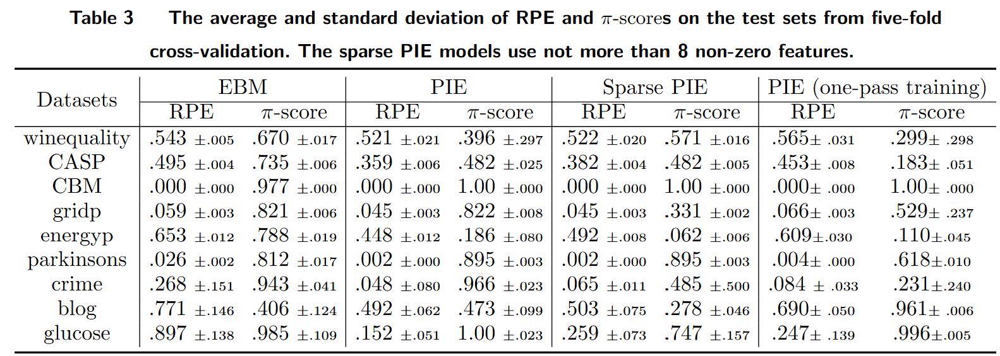

# PIE

This project is distributed in association with the [INFORMS Journal on
Computing](https://pubsonline.informs.org/journal/ijoc) under the [MIT License](LICENSE).

The software and data in this repository are associated with the paper [PIE -- A Partially Interpretable Model with Black-box Refinement](https://doi.org/10.1287/ijoc.2022.0098) by T. Wang, J. Yang, Y. Li, and B. Wang. 

## Version

The version used in the paper is

[](https://github.com/INFORMSJoC/Template/releases)

## Cite

To cite this software, please cite the [paper](https://doi.org/10.1287/ijoc.2022.0098) and the software, using the following DOI.

https://doi.org/10.1287/ijoc.2022.0098

https://doi.org/10.1287/ijoc.2022.0098.cd

## Description

This repository implements a novel Partially Interpretable Model (PIE) framework introduced by Wang et al. <arxiv:2105.02410>. This framework jointly train an interpretable model and a black-box model to achieve high predictive performance as well as partial model transparency.

## Demo with Winequality Dataset

The PIE framework is now uploaded as an R packages. To use PIE model,

```
library(PIE)
```

Next, a subset of winequality data will be used as an example. 

```
data("winequality")
```

To PIE model jointly train an group lasso and a XGBoost model, therefore, we need to first process the data into feasible format with `data_process()` function. The `data_process()` function returns a `lasso_group` to indicate splined numerical features and five fold training, validation and testing by default. Please refer to `PIE` packages document for detail description. 

```
# Which columns are numerical?
num_col <- 1:11
# Which columns are categorical?
cat_col <- 12
# Which column is the response?
y_col <- ncol(winequality)

# Data Processing
dat <- data_process(X = as.matrix(winequality[, -y_col]), 
  y = winequality[, y_col], 
  num_col = num_col, cat_col = cat_col, y_col = y_col)
```

After processing data, PIE model is ready for training. For time saving, iterations `iter=5` is used here. In practice, iterations `iter=500`.
```
fold <- 1
fit <- PIE_fit(
  X = dat$spl_train_X[[fold]],
  y = dat$train_y[[fold]],
  lasso_group = dat$lasso_group,
  X_orig = dat$orig_train_X[[fold]],
  lambda1 = 0.01, lambda2 = 0.01, iter = 5, eta = 0.05, nrounds = 200
)
```

Once the PIE model is trained, it can be used to predict for future data.
```
# Prediction
pred <- predict(fit, 
  X = dat$spl_validation_X[[fold]],
  X_orig = dat$orig_validation_X[[fold]])
```

In our paper, model performance is evaluated through Relative Prediction Error(RPE). Mean Absolute Error (MAE) can also be used to evaluate model performances.
```
val_RPE_test <- RPE(pred$total, dat$validation_y[[fold]])
val_RPE_test <- MAE(pred$total, dat$validation_y[[fold]])
```
Finally, `sparsity_count()` function can be used to know how many features are used in white-box group lasso model.

```
sparsity_count(fit$Betas, dat$lasso_group)
```

## Data
All data used in this paper is publicly available.

For example, the dataset `winequality` is Wine Quality Data Set introduced in Cortez et al. (2009). The link to the dataset is \url{https://archive.ics.uci.edu/ml/datasets/Wine+Quality}. 

The original link to the rest of datasets used in this paper are explained in appendix.

## Results

Figure 2(a)(b) in the paper shows the prediction breakdown for parkinsons data.


Table 2 and 3 in the paper shows the comparable performance of PIE.




## Replicating

To replicate the results in [Figure 2(a)](results/Analysis_parkinsons_20_graph.png) and [Figure 2(b)](results/Analysis_parkinson_average20_error_graph.png).

Run [drawing_avg.R](scripts/graphs/drawing_avg.R) with RData [parkinsons_3_184.RData](data/parkinsons/parkinsons_3_184.RData)
Run [drawing_instance.R](scripts/graphs/drawing_instance.R) with RData [parkinsons_3_184.RData](data/parkinsons/parkinsons_3_184.RData)

For other datasets, change the `feature_names` and load corresponding RData.

To replicate the results in [Table 2](results/table2.png), it contains two parts: baselines and PIE performances.
For baselines, please run [load_functions_Regression.R](scripts/baseline/load_functions_Regression.R) then [parkinson_baseline_code.R](scripts/baseline/parkinson_baseline_code.R) as an example for parkinson dataset. For the rest of the dataset, simply modify the data loading part. For PIE model evaluation, originally, we trained on HPC with parallel computing to fasten the speed. With your local machine, a grid search for parameters can be explored. Code for HPC and HPC setting are uploaded in [scripts/PIE_performance]. Sparsity PIE in [Table 3](results/table2.png) just add additional condition - sparsity_count features less than 8 when selecting models.

*[load_functions.R](scripts/PIE_performance/load_functions.R)* contains sourse code for PIE model, e.g. fitting and predict.<br>
*[parkinsons_load.R](scripts/PIE_performance/parkinsons_load.R)* process the parkinson dataset for PIE model to use.<br>
*[parallelCV.R](scripts/PIE_performance/parallelCV.R)* contains code to fit PIE model and predict with PIE model for different parameters based on  passing on arguments.<br>
*[parallelFinal.R](scripts/PIE_performance/parallelFinal.R)* contains final process code to gather all parallel running PIE model performances and pick the best five model for each fold based on the validation performance (note, although we generate the evaluate for test as well, we only use validation performance for parameter tuning.)<br>
*[parallelFinal_sparsity.R](scripts/PIE_performance/parallelFinal_sparsity.R)* similar file to parallelFinal.R, the only difference is the selection condition limite the sparsity features less or equal to 8.<br>
*[parkinsons.sh](scripts/PIE_performance/parkinsons.sh)* contains the command for HPC to run in parallel.<br>

**Please note that if you starts from data processing, results might be slightly different from our results due to the randomness of 5 fold cross validation split**

## Ongoing Development

This code is being developed on an on-going basis at the author's
[Github site](https://github.com/MissTiny/2022.0098).

## Support

For support in using this framework, submit an
[issue](https://github.com/INFORMSJoC/2022.0098/issues/new).
